# Screenshots

Captured from the automated QA run against the production build. The records visible in these
images (one branch, one employee, one visit, one expense) were entered **through the app's real
workflows** by the end-to-end test suite — the shipped database is empty and fills through the
first-run setup wizard.

## Executive Dashboard

Light:

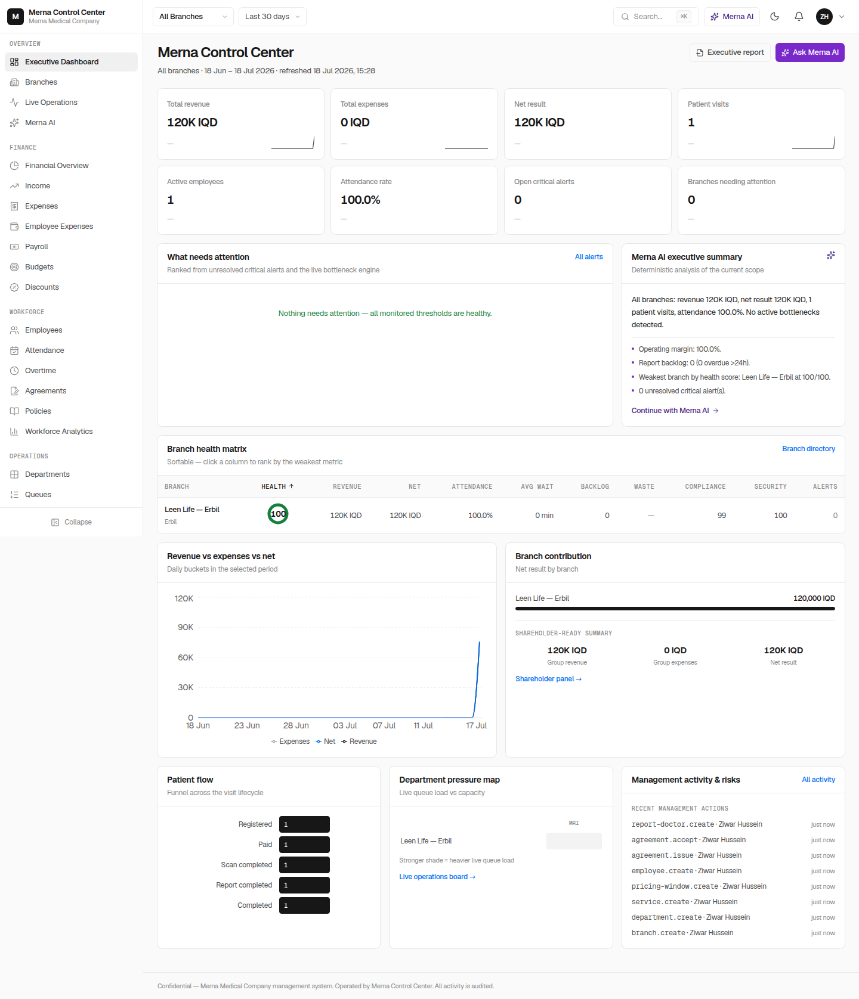

Dark:

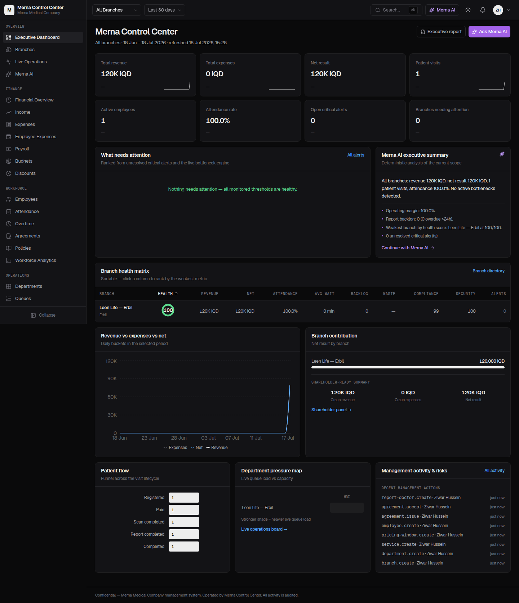

Laptop width:

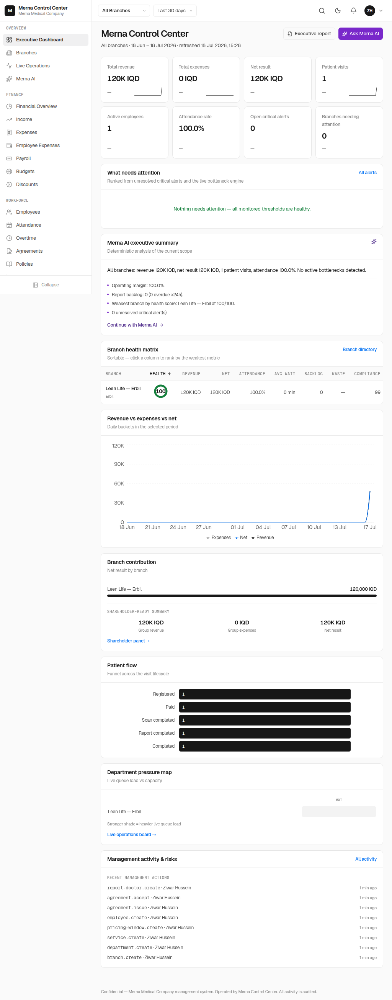

## Finance

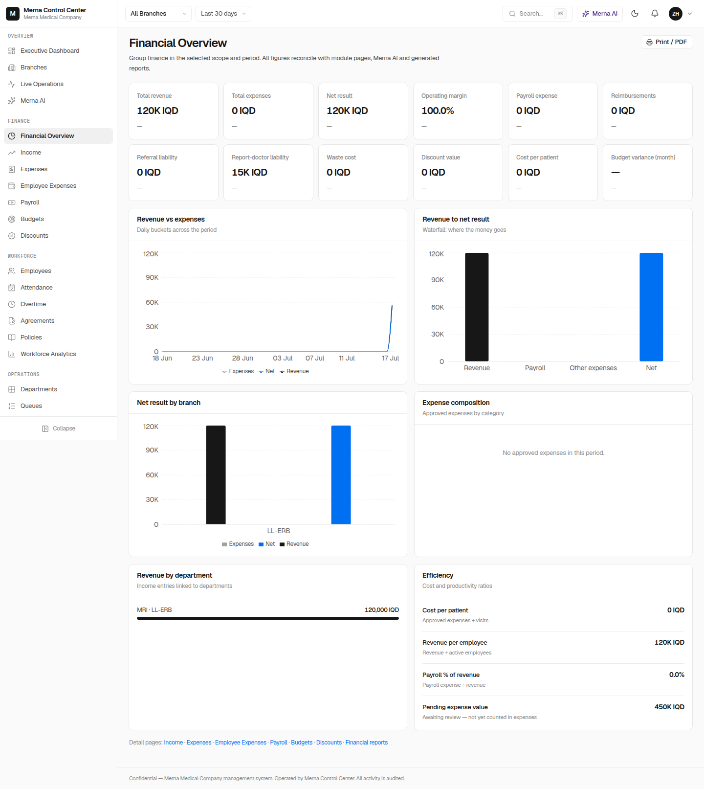

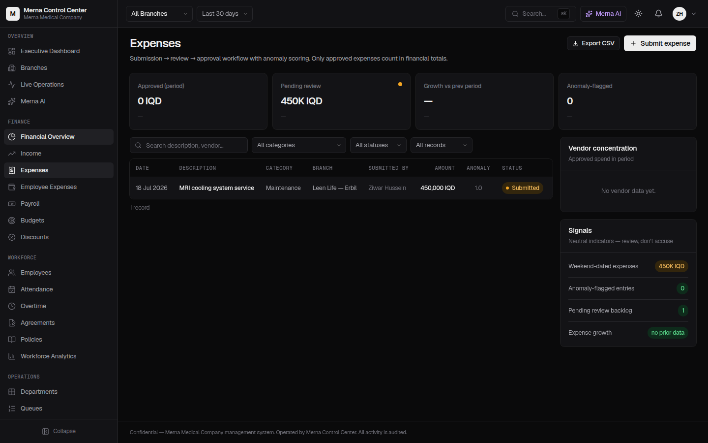

## Operations

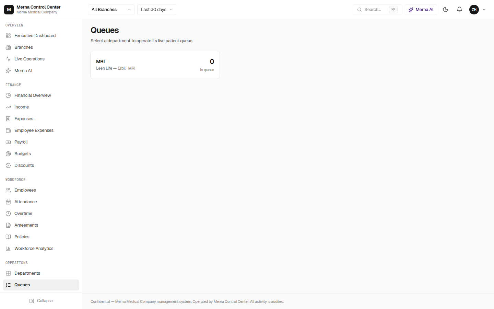

## Merna AI

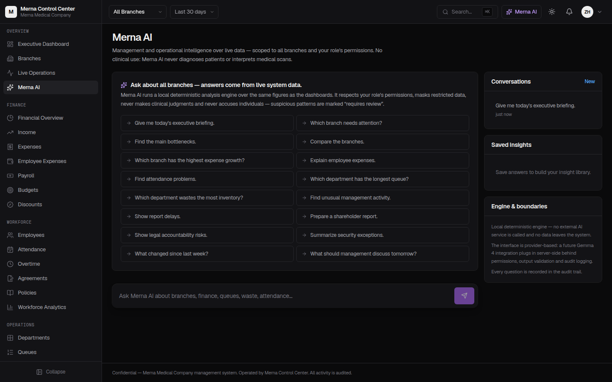

## Governance

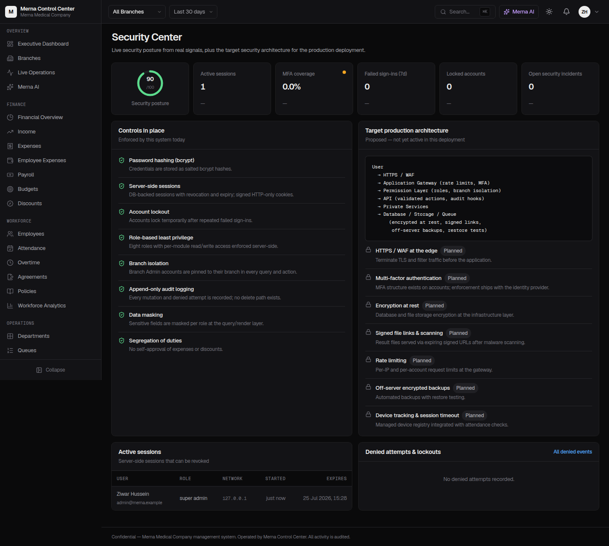

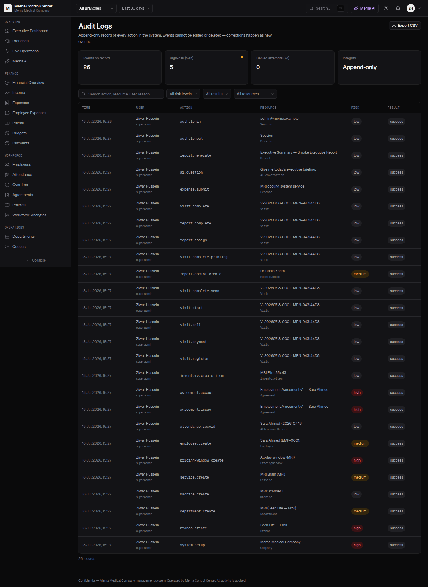

## Mobile

| Branches (dark) | Attendance (light) | Settings → Users (light) |
|---|---|---|
| 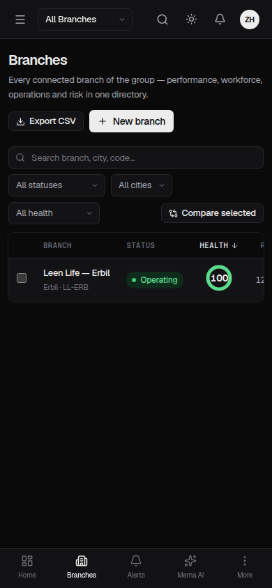 | 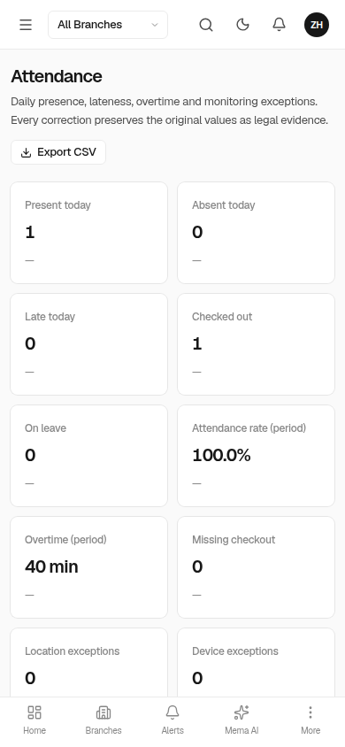 | 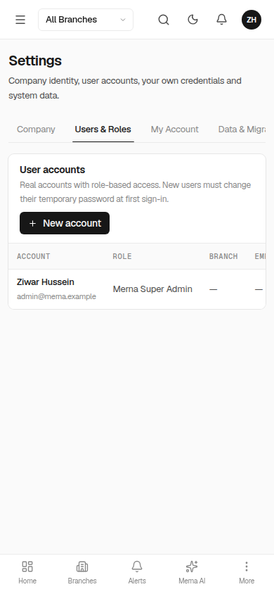 |
